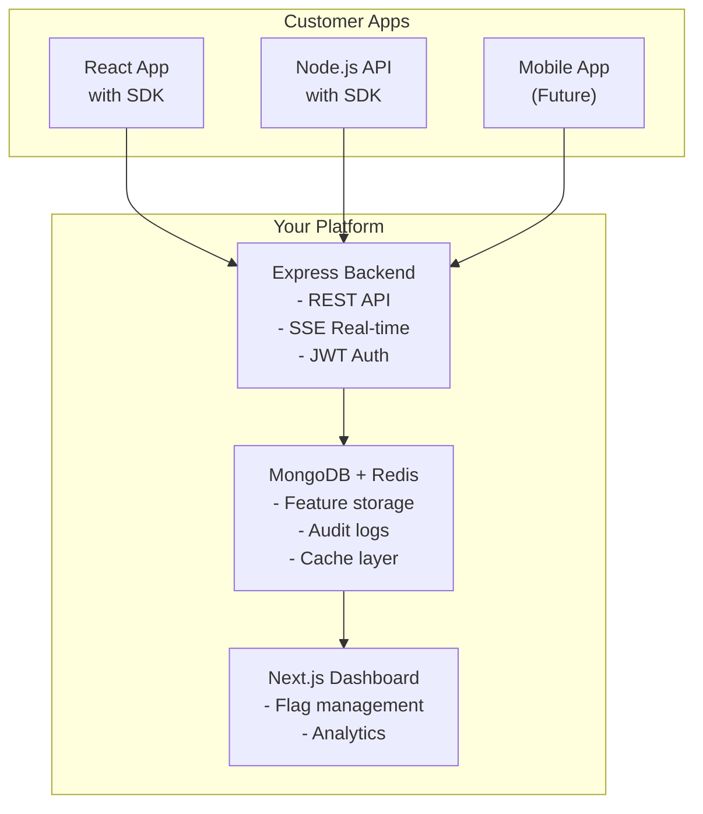

# Feature Flag System - Enterprise SaaS Platform

[](https://opensource.org/licenses/MIT)
[](https://nodejs.org)
[](https://www.typescriptlang.org/)

A **production-ready, enterprise-grade feature flag system** that allows teams to safely roll out features, run A/B tests, and target specific user segments - all with real-time updates and zero downtime.

## 🎯 What This Project Is

This is a complete **SaaS platform** that other developers can use to add feature flags to their applications. It includes:

- 🔧 **Backend API** - Express + MongoDB + Redis
- 🎨 **Admin Dashboard** - Next.js UI for managing flags
- 📦 **Client SDK** - React hooks and Node.js client (published on npm)
- 🔄 **Real-time updates** - SSE for instant flag changes
- 📊 **Audit logging** - Track every change
- ⚡ **Built-in caching** - Redis for sub-millisecond responses

## 📦 Project Structure

```text
feature-flag-system/
├── packages/
│ ├── backend/ # Express API server
│ │ ├── src/
│ │ │ ├── config/ # Configuration (DB, Redis, env)
│ │ │ ├── controllers/ # Route handlers
│ │ │ ├── middleware/ # Auth, validation, error handling
│ │ │ ├── models/ # MongoDB schemas
│ │ │ ├── repositories/# Database abstraction
│ │ │ ├── routes/ # API endpoints
│ │ │ ├── schemas/ # Joi validation
│ │ │ ├── services/ # Business logic
│ │ │ ├── utils/ # Helpers, logger
│ │ │ └── tests/ # Unit & integration tests
│ │ └── logs/ # Application logs
│ │
│ ├── frontend/ # Next.js admin dashboard
│ │ ├── app/ # Next.js 14 App Router
│ │ ├── components/ # Reusable UI components
│ │ │ └── ui/ # Basic UI components (Switch, Modal, etc.)
│ │ ├── hooks/ # Custom React hooks
│ │ ├── lib/ # API client, utilities, validation
│ │ └── types/ # TypeScript type definitions
│ │
│ ├── sdk/ # npm package for customers
│ │ ├── src/
│ │ │ ├── client/ # Core FeatureFlagClient
│ │ │ ├── react/ # React hooks and provider
│ │ │ └── types/ # TypeScript definitions
│ │ └── dist/ # Built files (published to npm)
│ │
│ └── shared/ # Shared types between packages
│ └── src/types/ # Common TypeScript interfaces
│
├── docker/ # Docker configuration
│ └── dev/ # Development docker-compose
```

## 🚀 Quick Start

### Prerequisites

- Node.js 18+
- MongoDB (local or Atlas)
- Redis (optional - falls back to memory cache)

### Installation

```bash
# Clone the repository
git clone https://github.com/your-org/feature-flag-system
cd feature-flag-system

# Install dependencies (workspaces)
npm install

# Set up environment variables
cp packages/backend/.env.example packages/backend/.env
cp packages/frontend/.env.example packages/frontend/.env

# Start development database (Docker)
npm run docker:up

# Start all services
npm run dev

# Or start individually:
# npm run dev:backend  (port 3001)
# npm run dev:frontend (port 3000)
```

## Environment Variables

**Backend (packages/backend/.env)**

```env
NODE_ENV=development
PORT=3001
MONGODB_URI=mongodb://localhost:27017/feature_flags
REDIS_URL=redis://localhost:6379
JWT_SECRET=your-secret-key-change-in-production
LOG_LEVEL=debug
CORS_ORIGIN=http://localhost:3000
```

**Frontend (packages/frontend/.env.local)**

```env
NEXT_PUBLIC_API_URL=http://localhost:3001
```

## 📚 Documentation


| Package | Documentation | Purpose |
|---------|---------------|---------|
| Backend API | packages/backend/README.md | API endpoints, authentication, deployment |
| Frontend Dashboard | packages/frontend/README.md | Admin UI setup, customization |
| Client SDK | packages/sdk/README.md | Using feature flags in your apps |

## 🏗️ Architecture



## 🛠️ Built With

| Technology | Purpose |
|------------|---------|
| Express 5 | Backend API framework |
| MongoDB | Primary database with optimistic locking |
| Redis | Caching for sub-ms responses |
| Next.js 14 | Admin dashboard (App Router) |
| TypeScript | Type safety across all packages |
| Joi | Request validation |
| Winston | Structured logging |
| Jest | Unit and integration tests |
| Docker | Development environment |

## ✨ Features

| Feature | Status | Description |
|---------|--------|-------------|
| Percentage rollouts | ✅ | Gradual feature release |
| User targeting | ✅ | By ID, attributes, or custom rules |
| Environment support | ✅ | dev/staging/production separation |
| Scheduled releases | ✅ | Future-dated feature activation |
| Audit logging | ✅ | Complete change history |
| Real-time updates | ✅ | SSE for instant dashboard sync |
| Optimistic locking | ✅ | Prevents concurrent update conflicts |
| Admin dashboard | ✅ | Full CRUD operations |
| Client SDK | ✅ | React hooks + Node.js client |
| Rate limiting | ✅ | Per-IP and per-API-key limits |
| Caching | ✅ | Redis with version-aware invalidation |

## 🤝 Contributing
1. Fork the repository
2. Create a feature branch (git checkout -b feature/amazing)
3. Commit changes (git commit -m 'Add amazing feature')
4. Push to branch (git push origin feature/amazing)
5. Open a Pull Request

## 📄 License
MIT © Arash Jafari


