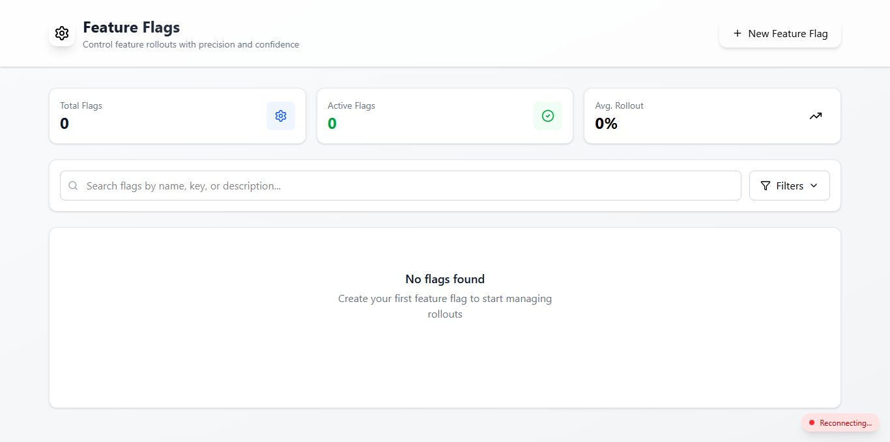

# Feature Flag Admin Dashboard

[](https://nextjs.org)
[](https://www.typescriptlang.org/)
[](https://tailwindcss.com)

Production-ready admin dashboard for managing feature flags. Built with Next.js 14 App Router, Tailwind CSS, and custom UI components.

## 🏗️ Architecture

```text
frontend/
├── app/ # Next.js App Router pages
│ └── page.tsx # Main dashboard (flag list, create/edit)
├── components/ # Reusable React components
│ ├── ui/ # Basic UI (Switch, Modal, Dialog)
│ └── forms/ # CreateFlagForm, EditFlagForm
├── hooks/ # Custom hooks
│ └── useRealtimeFlags.ts # SSE connection for live updates
├── lib/ # Utilities
│ ├── api/ # API client (axios)
│ ├── validation/ # Zod schemas
│ └── utils.ts # Helpers (formatDate, colors)
└── types/ # TypeScript definitions
```


## 🚀 Features

- ✅ **Flag Management** - Create, read, update, delete
- ✅ **Search & Filter** - By name, key, tags, status
- ✅ **Real-time Updates** - SSE for instant sync across tabs
- ✅ **Optimistic Locking** - Version conflict detection
- ✅ **Rollout Sliders** - Visual percentage control
- ✅ **Tag System** - Organize flags by category
- ✅ **Audit Logs** - View change history
- ✅ **Connection Status** - Live indicator for SSE
- ✅ **Responsive Design** - Works on desktop and tablet
- ✅ **Dark Mode Ready** - Tailwind theming ready

## 🔧 Environment Variables

```env
# .env.local
NEXT_PUBLIC_API_URL=http://localhost:3001
```

## 🚀 Quick Start

```bash
# Install dependencies
npm install

# Run development server
npm run dev

# Build for production
npm run build

# Start production server
npm run start
```

## 📱 Dashboard Features

 ### Flag Card
 
  - Flag name, key, tags
  - Status indicator (Active/Inactive)
  - Rollout progress bar
  - Last updated timestamp
  - Edit/Delete actions 

 ### Create/Edit Modal
 
  - Key validation (lowercase, underscores, no spaces)
  - Name and description fields
  - Rollout percentage slider
  - Tag management (add/remove)
  - Enable immediately toggle
  
 ### Create/Edit Modal
 
  - Real-time search by name/key
  - Filter by status (active/inactive)
  - Filter by tags (coming soon)

## 🐛 Error Handling
 
  - Key validation (lowercase, underscores, no spaces)
  - Network errors - Fallback to cached data
  - Validation errors - Inline error messages

## 📝 Dependencies

| Package | Purpose |
|---------|---------|
| next | React framework |
| react | UI library |
| react-dom | DOM rendering |
| axios | HTTP client |
| zod | Schema validation |
| react-hook-form | Form handling |
| @hookform/resolvers | Zod integration |
| lucide-react | Icons |
| date-fns | Date formatting |
| tailwindcss | Styling |

## 🔄 Real-time Updates Flow

```text
Admin A toggles flag → Backend → SSE Broadcast → Admin B dashboard updates instantly
```

## 📸 Screenshots


